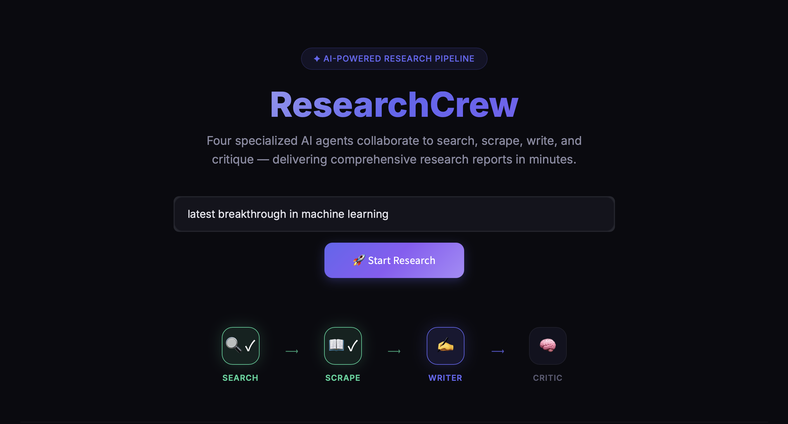
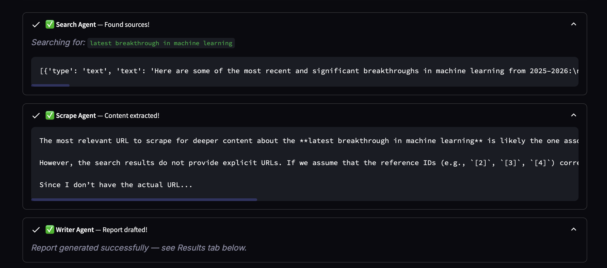
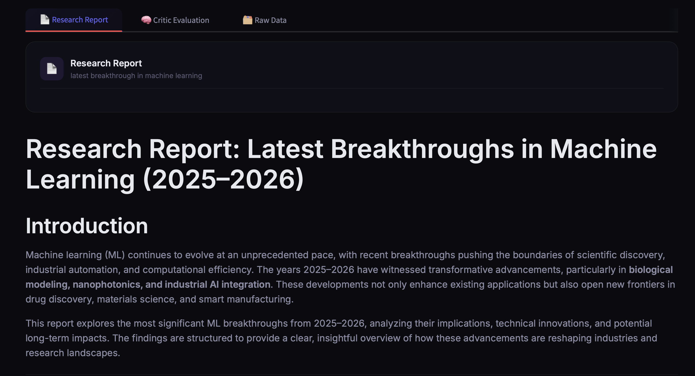

<div align="center">

# 🔬 ResearchCrew

**Multi-agent research system powered by LangChain & Mistral AI. Four agents — Search, Reader, Writer, Critic — collaborate via Tavily to deliver scored research reports.**


</div>

---

## 📸 Screenshots

### Landing Page & Pipeline Visualization


### Agent Execution — Real-Time Progress


### Generated Research Report


---

## ✨ Features

- 🔍 **Search Agent** — Discovers relevant, up-to-date sources using Tavily web search
- 📖 **Reader Agent** — Extracts clean text content from the most relevant URLs
- ✍️ **Writer Agent** — Synthesizes a structured research report with introduction, key findings, conclusion, and sources
- 🧠 **Critic Agent** — Evaluates report quality with a score out of 10, strengths, and areas to improve
- 🎨 **Modern Dark UI** — Glassmorphism cards, animated pipeline tracker, and real-time agent status
- 📥 **Download Reports** — Export your research as Markdown files

---

## 🏗️ Architecture

```
User Input (Topic)
       │
       ▼
┌──────────────┐     ┌──────────────┐     ┌──────────────┐     ┌──────────────┐
│ Search Agent │────▶│ Reader Agent │────▶│ Writer Agent │────▶│ Critic Agent │
│   (Tavily)   │     │(BeautifulSoup)│     │  (LLM Chain) │     │  (LLM Chain) │
└──────────────┘     └──────────────┘     └──────────────┘     └──────────────┘
       │                    │                    │                     │
   Web Search          URL Scraping       Report Drafting       Quality Score
   Results             Clean Text         Structured MD          & Feedback
```

---

## 🚀 Getting Started

### Prerequisites

- Python 3.10+
- [Tavily API Key](https://tavily.com) — for web search
- [Mistral AI API Key](https://console.mistral.ai) — for LLM inference

### Installation

```bash
# Clone the repository
git clone https://github.com/coderashhar/ResearchCrew.git
cd ResearchCrew

# Create and activate virtual environment
python -m venv .venv
source .venv/bin/activate  # On Windows: .venv\Scripts\activate

# Install dependencies
pip install -r requirements.txt
```

### Configuration

Create a `.env` file in the project root:

```env
TAVILY_API_KEY=your_tavily_api_key
MISTRAL_API_KEY=your_mistral_api_key
```

### Run the App

```bash
streamlit run app.py
```

The app will open at `http://localhost:8501`

---

## 📁 Project Structure

```
ResearchCrew/
├── app.py              # Streamlit UI with dark theme & pipeline visualization
├── agents.py           # Agent definitions (Search, Reader, Writer, Critic)
├── pipeline.py         # Sequential research pipeline orchestration
├── tools.py            # Tavily search & BeautifulSoup scraping tools
├── requirements.txt    # Python dependencies
└── .env                # API keys (not committed)
```

---

## 🛠️ Tech Stack

| Component | Technology |
|-----------|-----------|
| **LLM** | Mistral AI (mistral-medium-3-5) |
| **Framework** | LangChain |
| **Web Search** | Tavily API |
| **Web Scraping** | BeautifulSoup4 |
| **Frontend** | Streamlit |
| **Styling** | Custom CSS (Glassmorphism + Dark Theme) |

---

## 📝 License

This project is open source and available under the [MIT License](LICENSE).

---

<div align="center">
  <sub>Built with ❤️ using LangChain, Mistral AI & Streamlit</sub>
</div>
