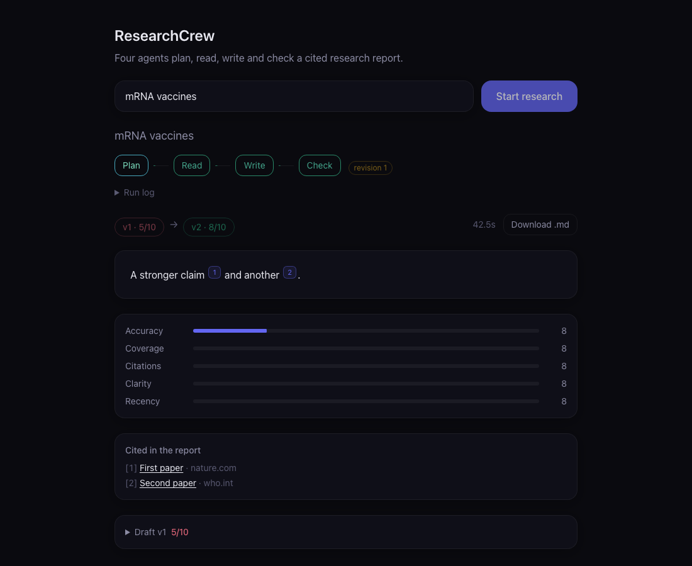
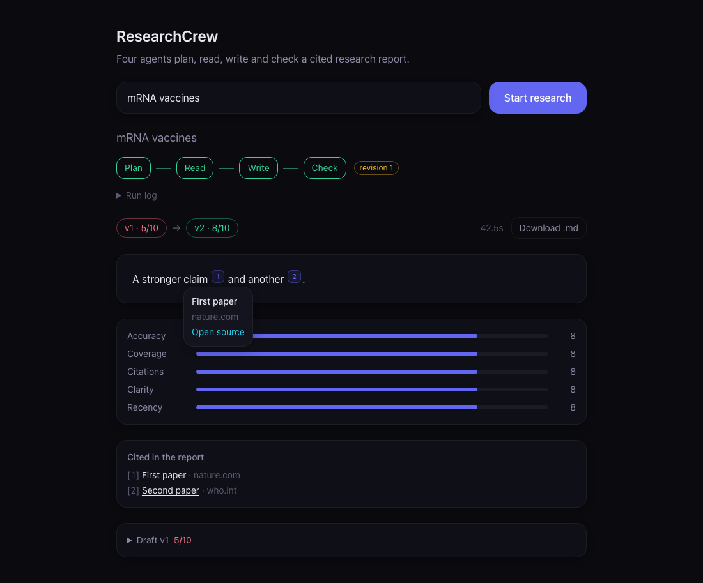

<div align="center">

# 🔬 ResearchCrew

**A research analyst you can check.** Agents plan the searches, read the sources,
write the report and grade it — and a weak report is sent back for revision
instead of shipped. Every claim carries a citation to a page the system
actually read.

</div>

---

## What it does

You give it a topic. It gives you back a cited report, plus everything it took
to get there.

1. **Plan** — turns the topic into 3-4 complementary searches, choosing news or
   general per query.
2. **Read** — searches with Tavily, keeps the six best results (one per domain)
   and reads all of them in parallel. A page that cannot be read is skipped, not
   fatal.
3. **Write** — writes from the numbered sources, citing each claim as `[n]`.
4. **Check** — a second model scores accuracy, coverage, citation quality,
   clarity and recency, and lists claims the sources do not support.

Then the loop decides: **accept**, **rewrite** from the same sources, or **go read
more** — up to 2 revisions, 1 extra research round, and a 220s budget.

Citations that match no source are stripped, and the Sources section is built
from the citations left, so the report can only list pages that were read.

## Screenshots

| Running | Finished report |
| --- | --- |
|  |  |

## How it is built

```
frontend/   Next.js 16 (App Router, Tailwind) — streams the run, renders the report
backend/    FastAPI + LangGraph — the agents, served over server-sent events
  research/ config, schemas, tools (Tavily), agents (Mistral), graph, citations, db
  cli.py    the same graph from a terminal
docs/       the phase plan
scripts/    smoke test against a deployment
```

Both deploy as **Vercel services** in one project (`vercel.json`): `/api/*` goes
to the Python service, everything else to Next.js. A run streams its progress,
with a heartbeat every 10s so no intermediary drops the connection, and is saved
to **Neon Postgres** — so `/r/{id}` serves the report again later.

| Piece | Choice |
| --- | --- |
| Models | Mistral (`WRITER_MODEL`, `CRITIC_MODEL` — different by default) |
| Search & extraction | Tavily, with a BeautifulSoup fallback |
| Orchestration | LangGraph `StateGraph` with a conditional edge after the critique |
| Storage | Neon Postgres |
| Frontend | Next.js 16, Tailwind v4, Radix popovers |
| Tests | pytest, Vitest, Playwright |

## Running it locally

**Prerequisites:** Python 3.12, Node 22, a [Tavily](https://tavily.com) key, a
[Mistral](https://console.mistral.ai) key, and a Postgres URL (a free
[Neon](https://neon.tech) branch works).

```bash
# backend
cd backend
python -m venv .venv && .venv/bin/pip install -r requirements.txt
cp .env.example .env        # then fill in the keys
.venv/bin/python -m research.db migrate
```

```bash
# frontend
cd frontend && npm install
```

Run both together with the Vercel CLI, which applies the same routing as
production:

```bash
npx vercel dev -L
```

Or run them separately:

```bash
cd backend && .venv/bin/uvicorn main:app --port 8000
API_PROXY=http://127.0.0.1:8000 npm --prefix frontend run dev
```

One topic from the terminal, no web stack:

```bash
cd backend && .venv/bin/python cli.py "how do mRNA vaccines work"
```

## Configuration

| Variable | Required | Default |
| --- | --- | --- |
| `MISTRAL_API_KEY` | yes | — |
| `TAVILY_API_KEY` | yes | — |
| `DATABASE_URL` | for the API | — (`connect_timeout=30` is added; Neon sleeps) |
| `WRITER_MODEL` | no | `mistral-medium-3-5` |
| `CRITIC_MODEL` | no | `mistral-large-latest` |
| `PASS_SCORE` | no | `7` |
| `MAX_REVISIONS` | no | `2` |
| `TIME_BUDGET_S` | no | `220` |
| `CLIENT_HASH_SALT` | no | `""` (salts the hashed caller address) |
| `API_PROXY` | frontend, local only | — |

## Tests

```bash
cd backend && .venv/bin/pytest -q            # unit; network is blocked
cd frontend && npm test                      # Vitest
npx playwright install chromium && npm run e2e  # browser, against a stub API
```

Database tests need a **throwaway** branch — the fixture deletes rows:

```bash
cd backend && TEST_DATABASE_URL='postgresql://...' .venv/bin/pytest -q
```

## Deploying

1. Import the repo on Vercel (it reads `vercel.json`; Services must be enabled).
2. Set `MISTRAL_API_KEY`, `TAVILY_API_KEY`, `DATABASE_URL` and `CLIENT_HASH_SALT`
   in the project settings.
3. Apply the schema once: `python -m research.db migrate` with that
   `DATABASE_URL`.
4. Check the deployment end to end:

```bash
python scripts/smoke.py https://your-deployment.vercel.app
```

Functions cap at 300s on Hobby, which is why the graph carries its own 220s
budget. Runs are public, so each caller gets five per hour.

## License

MIT.
